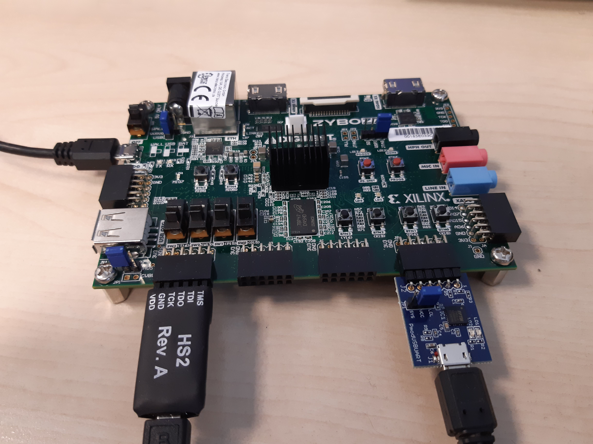
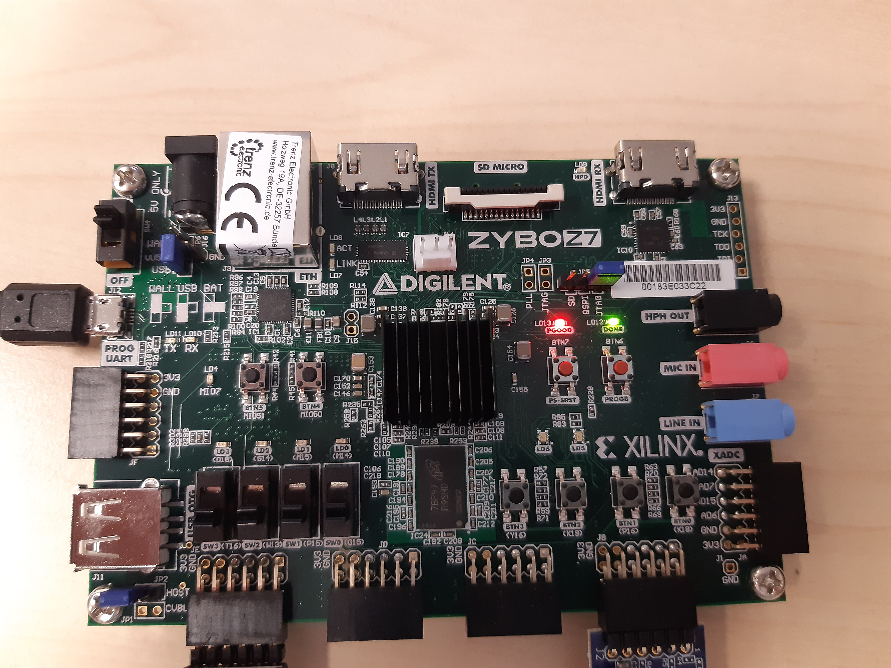
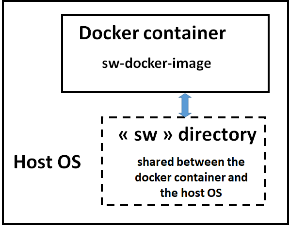

# RISCV-Crypto-Benchmark

**RISCV-Crypto-Benchmark** is a project designed to measure the performance of some symmetric-key cryptographic algorithms (AES,ChaCha20 and ASCON) on the [**RISC-V OPENHW GROUP CV32A6 SOFTCORE**](https://github.com/openhwgroup/cva6) architecture (with and without custom arithmetic instructions implemented on a CVXIF coprocessor) emulated on **ZYBO Z7-20** board. It enables the evaluation and comparison of differents cryptographics algorithms in terms of numbers of instructions and cycles used. 

It is based on the [**THALES CVA6 SOFTCORE CONTEST**](https://github.com/ThalesGroup/cva6-softcore-contest/blob/cv32a6_contest_24_25) toolchain and my own version of the CVA6 softcore, implementing a custom CVXIF coprocessor : [cva6_crypto](https://github.com/TristanBALDIT/cva6_crypto).

In addition, it contains some plotting python scripts already loaded with some of my measured datas.
The resulting graphs are in the **/results** folder.

## Getting started (run the benchmark)

Checkout my own cva6 repository and initialize all submodules:
```
$ git clone https://github.com/TristanBALDIT/cva6_crypto
$ git submodule update --init --recursive
```
### Get the Zybo ready

1. First, make sure the Digilent **JTAG-HS2 debug adapter** is properly connected to the **PMOD JE** connector and that the USBAUART adapter is properly connected to the **PMOD JB** connector of the Zybo Z7-20 board.


2. Generate the bitstream of the FPGA platform:
```
$ make cva6_fpga
```

3. When the bitstream is generated, switch on Zybo board and run:
```
$ make program_cva6_fpga
```
When the bitstream is loaded, the green LED `done` lights up.


4. Get a hyperterminal configured on /dev/ttyUSB0 115200-8-N-1

Now, the hardware is ready and the hyperterminal is connected to the UART output of the FPGA. We can now start the software.

### Get started with software environment

The benchmark executable application is already available in **sw/app**, but can be recompiled (to change for test params for example). 

#### Building the docker image

Install Docker on the workstation.

A **sw-docker** docker container is used to ease the installation of RISC-V tools including the toolchain and OpenOCD.

1. The **sw-docker** image can be built using the following command:

```
docker build -f Dockerfile --build-arg UID=$(id -u) --build-arg GID=$(id -g) -t sw-docker:v1 .
```

#### Using the docker image

the **sw-docker** Docker container consists of the entire RISC-V compilation chain as well as the openocd tool.

2. To compile software applications in **sw/app**, you need to use Docker container with the following command:

```
docker run -ti --privileged -v `realpath sw`:/workdir sw-docker:v1
```

The **sw** directory is mounted in the docker container.


Once in the **sw-docker** Docker container, you are in the default directory **/workdir** which corresponds to the sw directory in the host OS.

```
user@[CONTAINER ID]:/workdir$ ll
total 24
drwxrwxr-x  5 user user 4096 Nov 23 10:57 ./
drwxr-xr-x  1 root root 4096 Nov 24 09:09 ../
-rw-rw-r--  1 user user 2620 Nov 23 10:57 README.md
drwxrwxr-x 18 user user 4096 Nov 23 10:59 app/
drwxrwxr-x  5 user user 4096 Nov 23 10:57 bsp/
drwxrwxr-x  2 user user 4096 Nov 23 10:57 utils/
```

3. To compile mnist application, run the following commands.
```
user@[CONTAINER ID]:/workdir$ cd app
user@[CONTAINER ID]:/workdir/app$ make benchmark

```
At the end of the compilation the mnist.riscv executable file must be created.

4. Then, in the Docker container, launch **OpenOCD** in background:
```
user@[CONTAINER ID]:/workdir/app$ openocd -f openocd_digilent_hs2.cfg &
[1] 90
user@[CONTAINER ID]:/workdir/app$ Open On-Chip Debugger 0.11.0-dirty (2023-11-23-09:23)
Licensed under GNU GPL v2
For bug reports, read
    http://openocd.org/doc/doxygen/bugs.html
DEPRECATED! use 'adapter driver' not 'interface'
DEPRECATED! use 'adapter speed' not 'adapter_khz'
Info : auto-selecting first available session transport "jtag". To override use 'transport select <transport>'.
Info : clock speed 1000 kHz
Info : JTAG tap: riscv.cpu tap/device found: 0x249511c3 (mfg: 0x0e1 (Wintec Industries), part: 0x4951, ver: 0x2)
Info : datacount=2 progbufsize=8
Info : Examined RISC-V core; found 1 harts
Info :  hart 0: XLEN=32, misa=0x40141101
Info : starting gdb server for riscv.cpu on 3333
Info : Listening on port 3333 for gdb connections
Ready for Remote Connections
Info : Listening on port 6666 for tcl connections
Info : Listening on port 4444 for telnet connections
```

5. In the Docker container (same terminal), launch **gdb** as following:
```
user@[CONTAINER ID]:/workdir/app$ riscv-none-elf-gdb benchmark.riscv
GNU gdb (GDB) 14.0.50.20230114-git
Copyright (C) 2022 Free Software Foundation, Inc.
License GPLv3+: GNU GPL version 3 or later <http://gnu.org/licenses/gpl.html>
This is free software: you are free to change and redistribute it.
There is NO WARRANTY, to the extent permitted by law.
Type "show copying" and "show warranty" for details.
This GDB was configured as "--host=x86_64-pc-linux-gnu --target=riscv-none-elf".
Type "show configuration" for configuration details.
For bug reporting instructions, please see:
<https://www.gnu.org/software/gdb/bugs/>.
Find the GDB manual and other documentation resources online at:
    <http://www.gnu.org/software/gdb/documentation/>.

For help, type "help".
Type "apropos word" to search for commands related to "word"...
Reading symbols from benchmark.riscv...
(gdb)
```

6. In **gdb**, you need to connect gdb to **openocd** as following:
```
(gdb) target remote :3333
Remote debugging using :3333
Info : accepting 'gdb' connection on tcp/3333
Warn : Prefer GDB command "target extended-remote 3333" instead of "target remote 3333"
0x00010ec4 in ?? ()
(gdb)
```

7. In **gdb**, load **benchmark.riscv** to CV32A6 FPGA platform by the load command:
```
(gdb) load
Loading section .vectors, size 0x80 lma 0x80000000
Loading section .init, size 0x60 lma 0x80000080
Loading section .text, size 0xe518 lma 0x800000e0
Loading section .rodata, size 0x11c2c lma 0x8000e5f8
Loading section .eh_frame, size 0x3c lma 0x80020224
Loading section .data, size 0x91c lma 0x80020260
Loading section .sdata, size 0x60 lma 0x80020b80
Start address 0x80000080, load size 134108
Transfer rate: 57 KB/sec, 9579 bytes/write.
(gdb) 
```

8. At last, in gdb, you can run the **benchmark** application by command **c**:
```
(gdb) c
Continuing.
(gdb) 
```

9. On the hyperterminal configured on /dev/ttyUSB0 11520-8-N-1, you should see:
```
*benchmark results*
```


